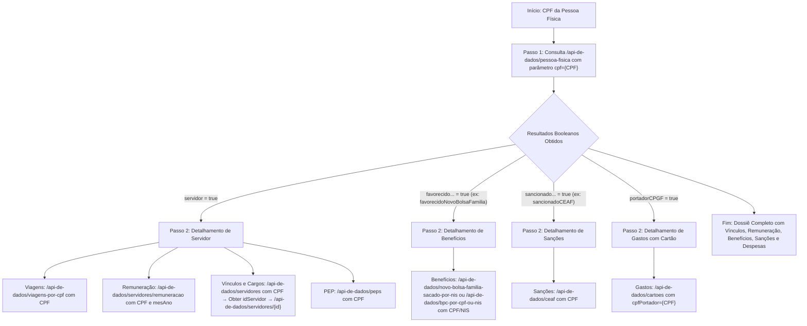
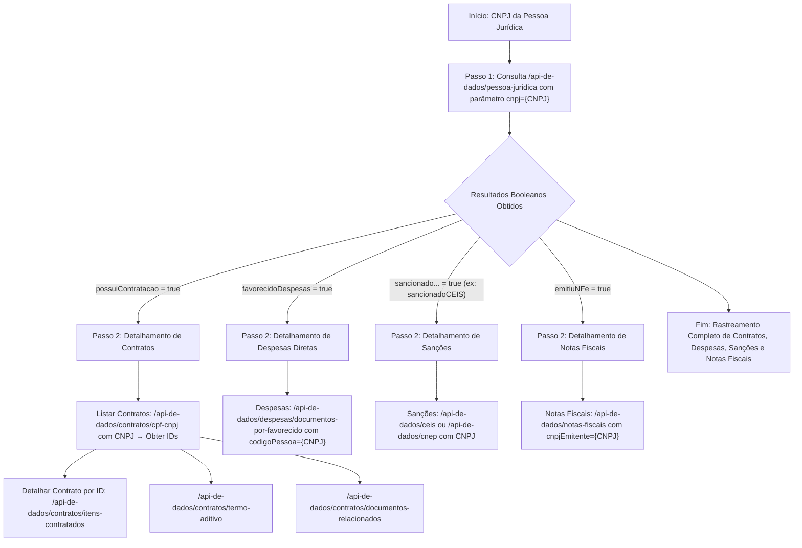

# Portal da Transparência - AI

## Índice

- [Descrição](#descrição)
- [Fluxos de Consulta](#fluxos-de-consulta)
- [Instalação](#instalação)
- [Uso](#uso)
- [Contribuição](#contribuição)
- [Licença](#licença)

## Descrição

Este projeto visa estruturar pesquisas inteligentes e técnicas no Portal da Transparência do Governo Federal brasileiro, utilizando as APIs oficiais do Portal da Transparência e do SIORG (Sistema de Informações Organizacionais do Governo Federal). A integração permite consultas precisas e automatizadas sobre pessoas físicas e jurídicas, com foco em dados públicos como vínculos, remunerações, benefícios, sanções e contratos.

A API do Portal da Transparência requer uma chave de autenticação (API-KEY), que deve ser configurada em um arquivo `.env`. Para detalhes sobre os endpoints, consulte a documentação oficial:

- [API do Portal da Transparência](https://api.portaldatransparencia.gov.br/swagger-ui.html)
- [API do SIORG](https://api.siorg.economia.gov.br/openapi.yaml)

Os fluxos de consulta descritos a seguir maximizam a extração de informações, partindo de identificadores únicos como CPF ou CNPJ.

## Fluxos de Consulta

Os fluxos a seguir representam sequências otimizadas para consultas, baseadas na estrutura da API do Portal da Transparência. Eles utilizam endpoints iniciais de mapeamento para identificar registros associados e, subsequentemente, detalhar áreas específicas. Os diagramas são renderizados em formato Mermaid para visualização clara.

### Fluxo 1: Investigando uma Pessoa Física (a partir de um CPF)



### Fluxo 2: Investigando uma Pessoa Jurídica (a partir de um CNPJ)



## Instalação

1. **Clone o repositório:**

   ```bash
   git clone https://github.com/your-repo/portal-transparencia-ai.git
   cd portal-transparencia-ai
   ```

2. **Instale as dependências usando UV:**

   ```bash
   uv install
   ```

3. **Configure a API-KEY:**
   Crie um arquivo `.env` na raiz do projeto e adicione a sua API-KEY do Portal da Transparência:

   ```plaintext
   PORTAL_API_KEY=your_api_key_here
   ```

4. **Execute o projeto:**

   ```bash
   uv run src/index.py
   ```

## Uso

O projeto é implementado em Python, utilizando argumentos de linha de comando para especificar o tipo de consulta.

### Consulta de Pessoa Física

Para consultar uma pessoa física, utilize o comando abaixo, substituindo `{CPF}` pelo CPF desejado:

```bash
uv run src/index.py --cpf {CPF}
```

### Consulta de Pessoa Jurídica

Para consultar uma pessoa jurídica, utilize o comando abaixo, substituindo `{CNPJ}` pelo CNPJ desejado:

```bash
uv run src/index.py --cnpj {CNPJ}
```

Esses comandos seguem os fluxos descritos na seção anterior, gerando relatórios detalhados com base nos dados disponíveis.

## Contribuição

Contribuições são bem-vindas e devem seguir padrões de qualidade e documentação. Para contribuir:

1. **Faça um Fork do repositório.**

2. **Crie uma nova branch para sua feature ou correção:**

   ```bash
   git checkout -b feature/nome-da-sua-feature
   ```

3. **Realize as alterações e commit com mensagens claras:**

   ```bash
   git commit -m "Descrição precisa das alterações implementadas"
   ```

4. **Envie para o repositório remoto:**

   ```bash
   git push origin feature/nome-da-sua-feature
   ```

5. **Abra um Pull Request no repositório original,** descrevendo as mudanças, impactos e testes realizados.

### Código de Conduta

Adira ao [Código de Conduta](CODE_OF_CONDUCT.md) para manter um ambiente colaborativo respeitoso.

### Relatórios de Bugs

Registre issues no GitHub com detalhes reproduzíveis, incluindo ambiente, passos e logs de erro.

## Licença

Este projeto está licenciado sob a Licença MIT. Consulte o arquivo [LICENSE](LICENSE) para detalhes.
